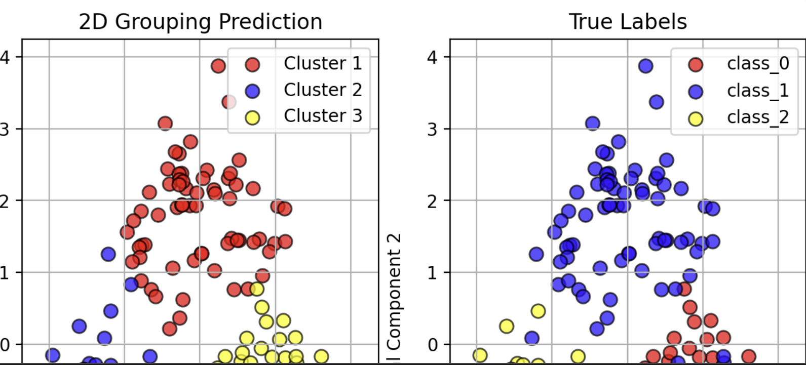
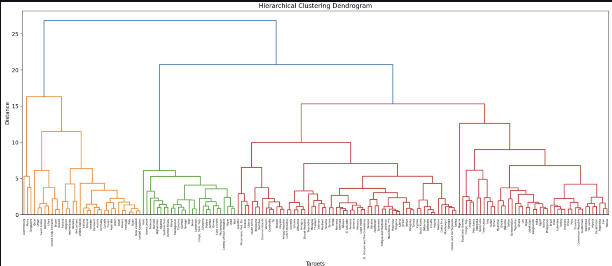

# Final Project - Unsupervised Machine Learning Streamlit App
For references and instructions, scroll to the bottom.

**Project Overview 📚:**
- This project provides a way for the user to explore machine learning models that make predictions of unstructured data. It also provides handy visualizations! The two models are KMeans clustering (attempting to group observations to represent unknown labels) and hierarchical clustering (revealing multi-level patterns in unstructured data).

**References 🧾:**
- Understanding the wine dataset: https://www.kaggle.com/code/cristianlapenta/wine-dataset-sklearn-machine-learning-project
- Early and ununused attempt at generating colors: https://pypi.org/project/distinctipy/
- Much of the code is drawn from the notes of Professor Smiley's Intro to Data Science class

**Instructions 🏫:**
Once you have opened the streamlit app, there are instructions in the app. If you don't want to read those, here they are!
- This app is a demonstration of the potential of two machine learning techniques - K-Means Clustering and Hierarchical Clustering - to reveal structure in unlabeled data. You can choose between the two techniques. If you choose K-Means, you can see an analysis of a pre-uploaded dataset or of one you upload; if you choose Hierarchical Clustering, you can see an analysis of a different pre-uploaded dataset.

**Features 🔥:**
- User-input: upload your own dataset!
- ML Model selection: choose between KMeans clustering and Hierarchical clustering
- Instructions and information clearly displayed on the app!
- Visualizations (First below: snippet of two side-by side graphs (labels not visible in screenshot) - one shows the KMeans Model's prediction of wine regions, and the other shows the actual labels. Second below: denrogram grouping countries.)

